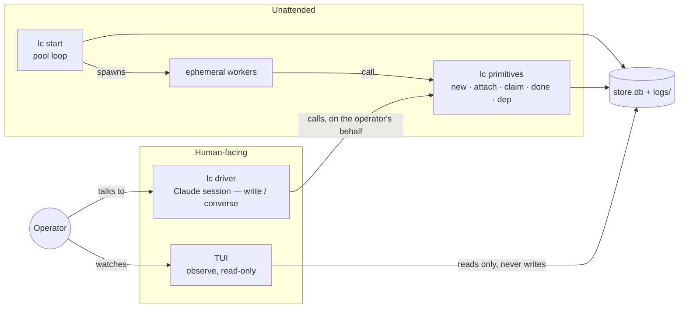
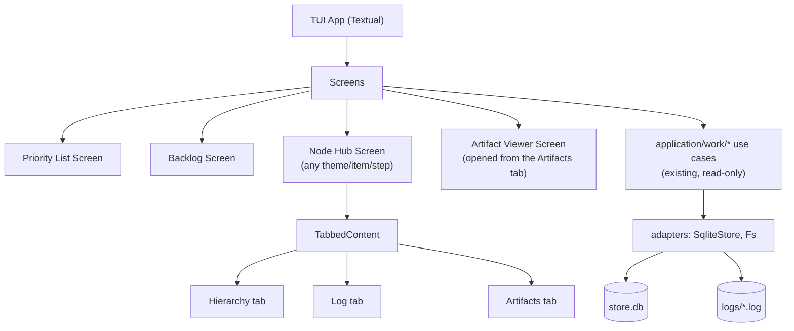
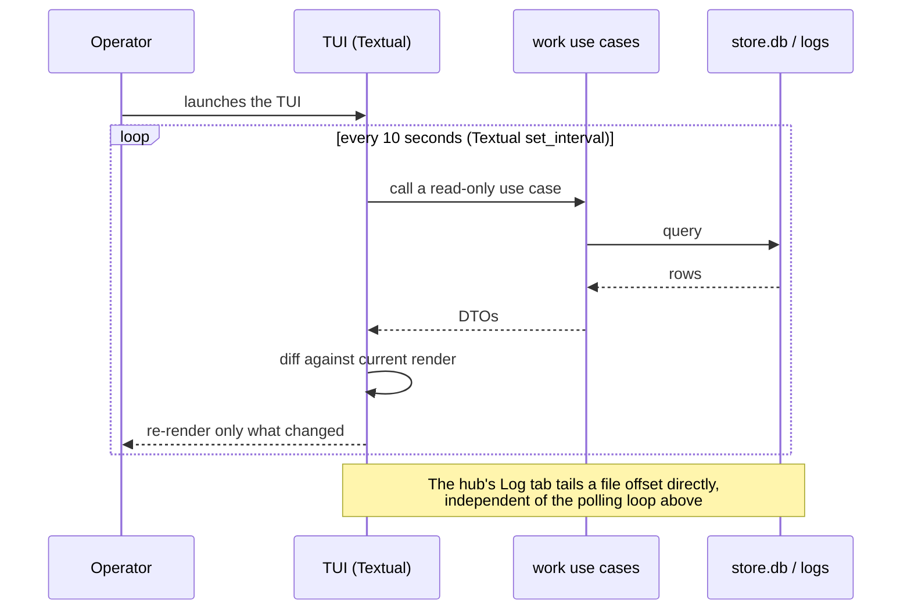
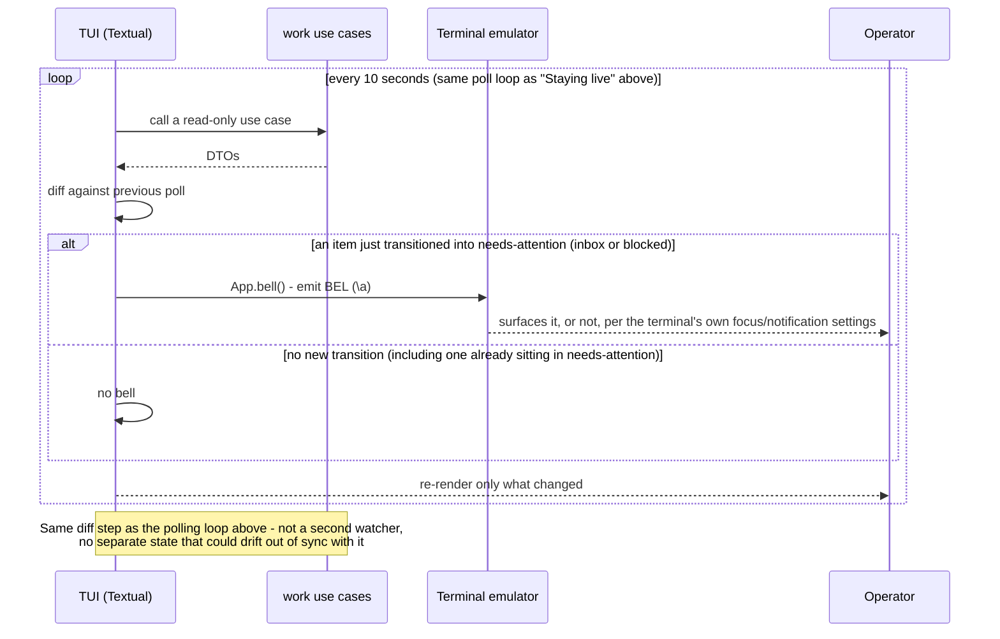

## TUI Architecture — Operator Monitors the Pipeline

Draft for review. Covers the stack, how the TUI talks to the engine, how it stays live, and where it
sits relative to lightcycle's other surfaces.

## The three surfaces

lightcycle already has an unattended loop and an internal agent protocol; this project adds the
missing human-facing read surface. It's worth drawing all four pieces together once, since it's easy
to conflate "the CLI" with "how the operator uses lightcycle" when really the operator touches only
two of these four things directly.

The raw `lc` primitives (`new`, `attach`, `claim`, `done`, `dep`, ...) are an internal protocol between
the engine and its agents - worker and driver alike - not a human-facing UX. The operator never types
them directly; `lc driver` calls them in conversation, the same way this session has been calling
Saga's MCP tools rather than the human typing raw API calls. The TUI doesn't replace or wrap `lc
driver` - it fills the gap a conversational surface is structurally bad at: passive, glanceable,
real-time awareness across several things happening at once. That's the concrete reason "Observation
Only" is correct, not just a scope-discipline choice - a better surface for the write path already
exists.

## Stack

**Language: Python 3.11+**, matching the engine. This isn't just consistency for its own sake - it
means the TUI can call the engine's existing read-only use cases _in-process_, reusing tested logic
instead of re-deriving it against a second interface (an HTTP API, a CLI-output parser, or hand-rolled
SQL against the store file).

**Framework: [Textual](https://textual.textualize.io/)**. Reasoning:

- Its `Tree` widget maps close to directly onto the Hierarchy tab - the always-expanded,
  sticky-ancestry view we designed is close to what it does out of the box.
- `TabbedContent` maps directly onto the node hub's Hierarchy/Log/Artifacts structure.
- Built-in scrollable list widgets cover the Priority List and Backlog.
- Async-native, which fits the polling model below and live log tailing naturally, without threading
  gymnastics.
- A real testing story (`textual.testing`, a `Pilot` API for driving screens programmatically in
  tests) - matters here given how seriously this codebase already takes test tiers.

## Dependency stance - and a rule that needs to change

The engine's current rule is "zero runtime dependencies for `lightcycle/`." Framed as "would any human
ever run this without the TUI," the answer for this deployment is no - it's a single-operator tool, and
the TUI replaces `watch -n10 "lc inbox"` spread across five terminals, not a nice-to-have alongside it.
An opt-in extras flag (`pip install lightcycle[tui]`) would only protect a hypothetical user who doesn't
exist here, at the cost of making the actually-load-bearing surface something people have to know to
ask for.

So: **Textual becomes a normal dependency of the `lightcycle` distribution**, not extras-gated. The
rule that needs to change is its _scope_, not its existence - "small trust surface, clone-and-run,
stdlib-only" still earns its keep for code that executes _unattended_: the pool loop, and everything a
worker touches via `lc claim`/`lc done`. That code never imports the TUI package and shouldn't need to
reason about its dependencies. The TUI is something a human launches and sits in front of - a different
trust and portability calculus applies to code that only ever runs interactively, in front of the
person who owns the machine.

Rewording the engine's own rule to say so is **change 2 below** - part of this design's delivery, not a
follow-up.

## Module placement

The TUI is a **driving adapter** - something that calls _into_ the application layer from outside, the
same direction as a keypress, as opposed to a **driven adapter** like `SqliteStore` that the application
calls _out_ to through a port it defines. Hexagonal architecture's standard vocabulary treats both as
"adapters"; `cli.py` doesn't set a counter-precedent here despite living outside `adapters/` today -
it's a thin dispatcher (`main()`, no real internal structure), not an adapter-weight artifact, so its
placement never actually answered the question a substantial driving adapter like this one raises. The
TUI - multiple screens, widgets, a polling loop, per-type artifact rendering - is real adapter-scale
code, the same order of substance as the existing driven adapters.

**Module home: `lightcycle/adapters/tui/`**, alongside `sqlite_store.py`, `git.py`, and the rest.

Broadening the engine's description of `adapters/` to cover driving adapters is **change 3 below**.

## Engine interaction

In-process, via the existing read-only use cases in `lightcycle/application/work/` - the same layer
`lc status`/`lc show`/`lc trace` already call. No new protocol, no server (per the "Terminal-Native, No
Server" principle), no duplicated store-schema knowledge.

## Staying live: polling, not push

The engine has no event/pub-sub system for external readers - it's SQLite plus flat log files. "Live"
here means polling on a short interval, and tailing log files by byte offset for the hub's Log tab
specifically (not re-reading the whole file each tick).

Selection-follows-item (the story we wrote for the priority list) falls out of this model naturally:
the diff step re-associates the tracked entity's identity to its new row position rather than reasoning
about row indices.

## Alerting: the needs-attention bell

Firing condition: an item's bucket transitions _into_ needs-attention (inbox or blocked) - never on
every poll while it stays there, never on entry to active or queued. This isn't a separate watcher -
the poll loop's own diff step (above) already detects exactly this transition when it re-associates
each tracked entity's identity across polls; the bell hooks off that same diff rather than adding a
second mechanism that could drift out of sync with it. An item already sitting in needs-attention
doesn't re-trigger the diff, and therefore doesn't re-trigger the bell.

Mechanism: Textual's `App.bell()`, which emits the terminal BEL character (`\a`). Whether an unfocused
pane or tab actually surfaces that - audibly, visually, via a flashing tab title - is the terminal
emulator's decision, not the TUI's; this is exactly why "still fires when the dashboard isn't focused"
holds without the TUI doing anything focus-aware itself.

## Screen → widget mapping

| Screen (from the flow diagram) | Textual building block                                                                                                                                                                                                          |
| ------------------------------ | ------------------------------------------------------------------------------------------------------------------------------------------------------------------------------------------------------------------------------- |
| Priority List                  | `DataTable` or a custom `ListView`, sorted client-side after each poll                                                                                                                                                          |
| Backlog                        | Same widget as Priority List, plus a filter input bound to `f`                                                                                                                                                                  |
| Item / Node Hub                | A fixed header pane (identity, workflow, description, step/role/elapsed, why-escalated) above a `TabbedContent` with three panes - `[`/`]` cycle them, `TabbedContent.active` set to whichever matches the node's state on open |
| ↳ Hierarchy tab                | Textual's `Tree` widget, always-expanded (no collapse), custom render for the sticky-ancestry header and the current-node highlight                                                                                             |
| ↳ Log tab                      | `RichLog` or `Log` - fed by the file-tailing loop below when live, or a static read of the past log when the step is done                                                                                                       |
| ↳ Artifacts tab                | `ListView`, filtered to non-internal artifacts at the use-case layer. Always present, even when empty - see the artifact model below                                                                                            |
| Artifact Viewer                | Dispatched on the artifact's declared `kind`: `Markdown`/plain-text widget for `text`, `webbrowser.open()` for `url`, a small `subprocess` launcher (`open`/`xdg-open`) for `filepath`, `ListView` for `list`                   |

## Engine changes this design requires

The TUI cannot be built against the engine as it stands. **These are part of this design's delivery, not
prerequisites filed elsewhere.** The build is not complete until they land, and no story may disclaim
them as out of scope.

### Change 1 — the `Artifact` record gains `internal` and `kind`

`Artifact` is `(type, value, label)` today, where `value` is a bare string. Two fields are added, both
set at the point of attachment and never inferred at read time.

**`internal` (boolean)** - set at a handful of specific write points that produce bookkeeping the engine
keeps for its own algorithms: `application/feedback/reflect.py` (`reflection`),
`application/work/resolve_backlog.py` (`resolved-by`/`resolves`), `application/pool/monitor_prs.py`
(`watched-step`, `feedback-spawned-through`) - and `feedback-watermark`, which is set not by a
dedicated module but via the generic `lc attach --replace` primitive
(`application/work/link_artifact.py`), invoked by the feedback-handling step's own prompt. `monitor_prs.py`
only reads `feedback-watermark` back (its `_watermark()` helper) to compare against; it never writes
it. The hierarchy's content indicator and the Artifacts tab both count an artifact only when `internal`
is false.

**`kind` (string)** - how the artifact opens: `url`, `filepath`, `text`, `list`. Resolved in order:

1. Declared explicitly at the point of attachment, if given.
2. Otherwise defaulted from the artifact's `type`, for the types the engine already acts on:
   `pr` → `url`; `spec`, `brief` → `filepath`; `repo`, `branch` → `text`.
3. Otherwise `text`.

That default table adds no coupling the engine doesn't already have: `monitor_prs.py` polls GitHub for
a `pr` and drives the `pr_merge` hook off it, git operations use `repo` and `branch`, and
`_ID_BEARING_ARTIFACT_TYPES` in the sqlite store already keys logic on `spec` and `brief`. Attach-time
declaration is the override and the extension point, so a workflow attaching something novel is never
blocked at attach and never invisible at render - unknown kinds fall back to `text`, and since every
value is a string at rest, rendering stays a total function.

Neither field may be inferred from the value's shape (e.g. JSON vs plain string): a future workflow
could legitimately attach real JSON content. The `type` vocabulary itself stays free-form - a workflow
invents types freely, the engine simply has no default kind for them.

### Change 2 — the dependency rule narrows to the unattended path

The "zero runtime dependencies" line in the engine's own `CLAUDE.md` is reworded to state that scope
explicitly: stdlib-only applies to code that runs _unattended_ (the pool loop and everything a worker
touches), not to a driving adapter a human launches interactively. Without this, a future contributor
reads the existing wording and reasonably concludes the TUI shouldn't exist as designed.

### Change 3 — `adapters/` broadens to cover driving adapters

`adapters/`'s current description in `CLAUDE.md` - "all IO... the only callers of sqlite3/git/subprocess"

- is broadened to cover driving adapters, since the TUI (like `cli.py`) calls use cases rather than
  sqlite3/git/subprocess directly.

### Change 4 — read-model gaps in `application/work/`

Anything the screens need that the existing read-only use cases don't expose is added _there_, not
worked around inside the TUI - otherwise store-schema knowledge leaks into the adapter and the
in-process reuse this stack was chosen for is lost. The screens are specified now (see the wireframes
and the API Contracts artifact), so the gaps are no longer unknowable the way this section originally
framed them - the API Contracts artifact states each one as a requirement (what the read surface must
make available), not as a prescribed code change; resolving each into an actual `application/work/`
change is still the **first work of the build**, not an open question deferred past it.

## Resolved decisions

- **Poll interval: 10 seconds.** Fine for a dashboard whose job is situational awareness, not a
  real-time feed - the hub's Log tab bypasses this entirely via direct file tailing.
- **Cross-platform file-open**: a small `subprocess` launcher (`open` on macOS, `xdg-open` on Linux) -
  lightcycle's dev environment is macOS/Linux only today, so this is a contained adapter, not a design
  risk.
- **Module placement: `lightcycle/adapters/tui/`** (see above).
- **The Artifacts tab is always present**, rendering an empty state when a node has nothing viewable,
  so the `[`/`]` cycle is the same three tabs on every node.

---

← Back to [Architecture](index.md)
